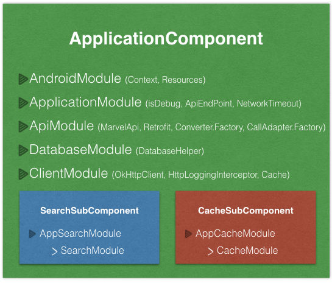

Marvel Application   
===============================

This repository holds the source code of the Marvel Application, a simple Android client for the [Marvel.com](http://marvel.com).
This application was created by [Mohsen Mirhoseini Argi](http://mirhoseini.com), as part of the technical assessment by the [smava GmbH](https://www.smava.de) team.

--------------------
### What is this repository for? ###

* Marvel Application
*       Version:  1.0
* Last Update: Fri Oct 21, 2016

--------------------
### Development Tools ###

* Android Studio v2.2.1
* gradle-plugin v2.2.1
* Android SDK Build Tools v25.0.0
* MinSdkVersion 9
* CompileSDKVersion 25
* Retrolambda v3.3.1

--------------------
### Dependencies ###

* Android Support Tools (recyclerView, cardView, vector, palette,... ) v25.0.0
* Retrofit v2.1.0
* OkHttp v3.4.1
* Dagger v2.8
* RxJava v1.2.3
* RxAndroid v1.2.1
* RxBinding v1.0.0
* ButterKnife v8.4.0
* Timber v4.3.1
* Picasso v2.5.2
* OrmLite v5.0
* Firebase v9.6.1
* AndroidUtils v1.0.7
* jUnit v4.12
* Android Support Test v0.5
* Mockito v1.10.19
* Robolectric v3.1-rc1
* Espresso v2.2.2

--------------------
### Important Notes ###

The application has two Activities, Main and Character Activities. The Main Activity is consist of two Fragments, Search and Cache Fragments, which are responsible for searching new Mavel characters and presenting recent searched characters.

All activity lifecycle and network behaviours are implemented, and according to device size and network situation user get a good UI and UX. If no internet connection or network error, a Snackbar pops up and ask user to turn on network connection or retry.

Some simple Test Cases was designed to test application UI functionality and core classes using jUnit and AndroidUnitTest.

### Application Structure ###

The Application implemented and structured bases on the MVP pattern best practice, contributed by [Antonio Leiva](http://antonioleiva.com/mvp-android/).

Whole application functionality is implemented in "Core-Lib" module using pure Java, and .the "App" module contain all codes required for Android Application to load on Android OS, which can be replace by any other interface (e.g. console app or web app)

The **view** (MainActivity), contain two fragments. Search and Cache fragments both contain their own presenter and implement View interfaces and the only thing that the view will do is calling a method from the presenter every time there is an interface action.

The **presenter** (Search or Cache Presenters), are responsible to act as the middle man between views and models. They retrieves data from the Model or Database and returns it formatted to the view. It also decides what happens when user interact with the view.

The **models** (Search Interactor), would only be the gateway to the service domain layer or business logic. In this case it provide the data needed to be displayed in the view from Network.

The networking and API call are managed by [Retrofit](http://square.github.io/retrofit/) and OkHttp as its httpclient, contributed by [Square](http://square.github.io). It also shows decent logs while application is running in Debug mode. 

Caching characters data is done using [OrmLite](http://ormlite.com), a Lightweight Object Relational Mapping (ORM) Java Package. Database layer can also be done using other ORM libraries like [realm](https://realm.io) or [DBFlow](https://github.com/Raizlabs/DBFlow). 

Layers communications are managed by [RxJava](https://github.com/ReactiveX/RxJava) & [RxAndroid](https://github.com/ReactiveX/RxAndroid) contributed by [ReactiveX](http://reactivex.io).

Dependency Injections are being managed by [Dagger](https://github.com/google/dagger) created by [Square](http://square.github.io) and now maintained by [Google](http://google.github.io/dagger/).

Some minor Android common functions are managed using [AndroidUtils](https://github.com/mmirhoseini/android_utils) library, developed and published on jCenter by [myself](http://mirhoseini.com).

Whole projects Dependencies are placed in "libraries.gradle" to avoid version conflicts and redundant in different modules.

Used new DataBinding library contributed by Google in Adapters for faster development, and added CustomBindingAdapter to handle downloading and caching images using [Picasso](http://square.github.io/picasso/) library, which also use google [Palette](https://developer.android.com/topic/libraries/support-library/features.html#v7-palette) support library as a helper class to extract prominent colors from image and making a related background for a better UI/UX.

The Android Log system is replaced with [Timber](https://github.com/JakeWharton/timber) contributed by Jake Wharton, which avoid logging in release version.

A general HashGenerator class generates the hash key required for calling API using params.

Used new SupportVector library in some icons cases for a better UI.

Used new [Google Firebase](http://firebase.google.com/) as application Analytics and CrashReport services. 

Sample test cases are implemented by mockito, espresso, robolectric and mocking dagger.

Finally, used [circleci](https://circleci.com/gh/mmirhoseini/marvel) and [travis ci](https://travis-ci.org/mmirhoseini/marvel) as Continues Integration services which are bind with [Github](https://github.com/mmirhoseini/marvel) repo.